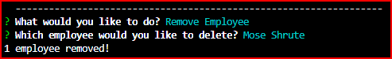

# Skye Lucking - FACT: This is the Employee Tracker!
 
<h1>Description of application</h1>
This Employee Management System allows a business owner to view and manage the departments, roles, and employees in their company they can organize and plan their business. They can:

 
Build a command-line application that at a minimum allows the user to:
  * View the total utilized budget of a department -- ie the combined salaries of all employees in that department
   
  * View departments, roles, employees 
   
   
   

  * View employees by manager 
   
  * Add departments, roles, employees 
   
   
   
  * Update employee roles 
   
   
  * Update employee managers 
   
   
  * Delete departments, roles, and employees 
    
   
    
   * Exit Out of Program 
    
 

 <h1>Special Modules/Packages/Extensions Used</h1>
* <a href="https://marketplace.visualstudio.com/items?itemName=BitBelt.converttoasciiart">Convert To ASCII Art</a> 
* Inquirer 
* MySql 
* FS 
 

<h1>Link To Video of CLI Application</h1>
<a href="https://vimeo.com/512763783">https://vimeo.com/512763783 </a> 
This video goes pretty quickly, so you might slow it down to .75 speed. 

<h1>Link to GitHub Repo</h1>
<a href="https://github.com/skyelucking/12-Employee-Tracker">https://github.com/skyelucking/12-Employee-Tracker</a>

<h1>Now here is your joke...</h1>  
To whoever stole my copy of Microsoft Office: I will find you!
 
 
<em>– You have my WORD!</em>
